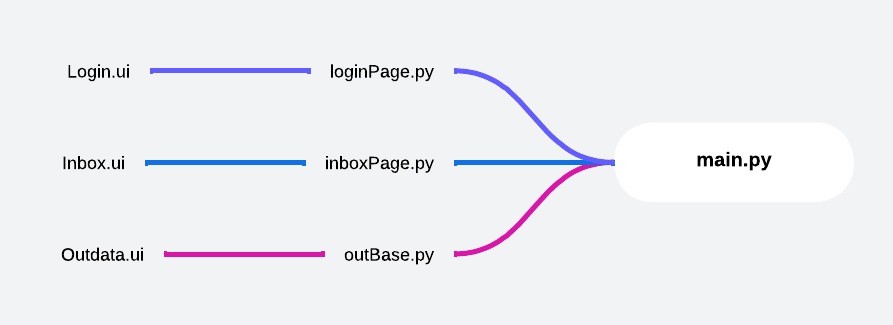

# DB project

A simple GUI project that save your user Id and password in DB.

## Run Locally

To run tests, run the following command


* Install requirements

```bash
  pip freeze > requirements.txt
```

* Run code
```bash
  python -u main.py
```


## File map



